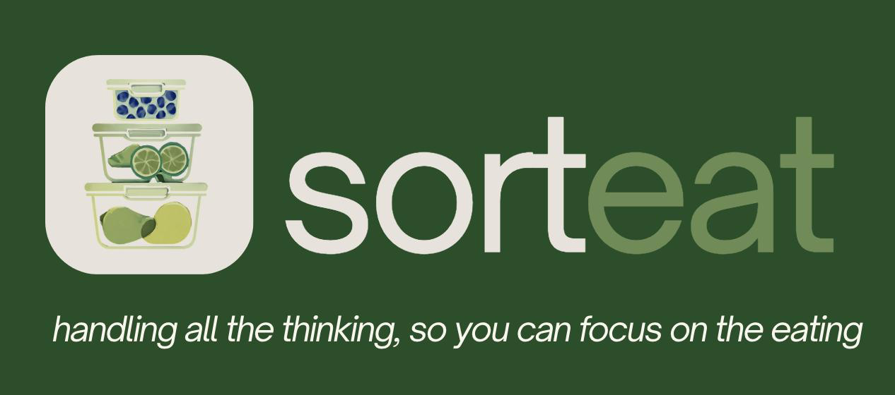

# Sorteat — HCI Project @Polimi



**[Try the live prototype →](https://sorteat-high-fidelity.vercel.app/)**

Human-Computer Interaction project at Politecnico di Milano, HINT Lab A.Y. 2025/2026
**Final grade: 30/30**

---

A mobile-first app that turns a shared kitchen into a virtual smart kitchen: one that remembers what's in the fridge, what's about to expire, and who owes whom for the groceries.


---

## The Problem

Four sentences you have said in your own kitchen this month:

| What people say | What Sorteat does |
|---|---|
| *"I didn't know the milk had gone off."* | Automatic expiry alerts, urgent items surfaced first |
| *"I bought stuff we already had."* | Shared inventory you can check from the supermarket aisle |
| *"I have no idea what to cook with this."* | Recipes ranked by what is already in the house |
| *"Who owes me for the shopping?"* | Automatic balance tracking between flatmates |

Food waste in shared homes is not a knowledge problem. It is a coordination and cognitive-load problem, and that premise drove every design decision here.

---

## Design Principle

> Remove every superfluous thought and action from the user: automate repetitive decisions, and surface only the information that matters, at the moment it matters.

Every screen in the prototype had to justify itself against that sentence.

---

## Try It Yourself

The prototype is fully interactive. You are logged in as **Mariia**, sharing a flat with **Giorgia** and **Luca**. Three walkthroughs, each built around a scenario from our field research.

### 1. "Do I actually need to buy this?"

*Luca is at the supermarket, standing in front of the milk. Buy it and he might find an open carton at home; skip it and there is no breakfast tomorrow.*

**Try it:** open **Inventory**, tap the search tab, type `latte`.

Two paths lead to the same answer. Search, for people who know what they are looking for. Or browse by location (Fridge, Pantry, Freezer), for people thinking spatially — *it's in the fridge, somewhere*. Either way the product card shows quantity, an expiry badge, and who owns it.

If the item belongs to a flatmate, it carries a lock and their avatar. Luca can buy his own, or tap **Ask [name]** — turning a potential conflict into a one-tap request.

### 2. "What do I cook tonight?"

*Mariia is at a farmers' market, staring at porcini mushrooms. She can already taste the risotto. What she cannot remember is whether she has Carnaroli rice, stock, or parmesan.*

**Try it:** open **Recipes**, tap *Risotto ai funghi* under the inspiration section.

Every ingredient is tagged against the real inventory:

| Badge | Meaning |
|---|---|
| Grey | In stock |
| Orange | In stock, expiring soon — use it now |
| Red | Missing, add to shopping list |
| Avatar + lock | Owned by a flatmate, ask them |

From there: cook now, drag the recipe into a slot in the weekly meal planner, or push missing ingredients straight to the shared shopping list.

### 3. "I just got back from the shop."

*Giorgia has eight items to log and zero desire to type.*

**Try it:** in **Inventory**, tap the green floating **+** button.

Two routes in. **Receipt scan** opens a camera view and returns a review screen where every field is editable inline — quantity, price, expiry via date picker, and a shared/private ownership toggle. **Manual entry** covers anything without a receipt, like the basil from the market.

Items added to the inventory are removed from the shopping list automatically. No second cleanup step.

---

## Key Interaction Decisions

**Ownership as a first-class concept.** Every item is either shared or private, with a lock icon and an owner avatar. This single primitive removes an entire class of household conflict, and makes "ask before you take" one tap instead of an awkward text.

**Expiry as colour, not as a date.** People do not parse dates under time pressure; they parse traffic lights. Urgency uses the same colour language across inventory, recipes, and notifications.

**Two entry points for every lookup.** Search and browse-by-location are not redundant. They serve two different mental models of the same fridge.

**The review step is the product.** Receipt scanning is only worth building if correcting it is faster than typing. Editing is inline, deletion is one tap, and nothing is committed until the user confirms.

---

## App Structure

```
Navigation Bar
├── Home        Personal spending and waste metrics
├── Inventory   Fridge / Pantry / Freezer, search, shopping list
├── Recipes     Meal planner and inspiration by time of day
└── Space       Household balances, settlements, transaction history
```

---

## Prototype Scope

A high-fidelity interactive prototype built for usability evaluation, not a production app. Deliberately out of scope:

- No real backend. Data is mock and `localStorage`, not persisted across sessions
- No authentication. The current user is fixed as Mariia
- Notifications are simulated with toasts
- Receipt OCR is simulated with predefined data
- Search is simple string matching
- Balance figures are illustrative, not computed from real transactions

